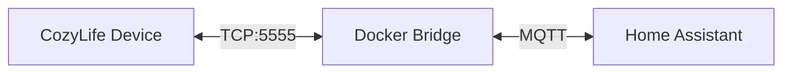

# cozylife-mqtt-ha

[](LICENSE)
[](Dockerfile)

Docker bridge for CozyLife smart lights to Home Assistant via MQTT Discovery.

## Why

Home Assistant has no official CozyLife integration. Existing custom components require HACS and run inside HA. This project takes a different approach: a **standalone Docker container** that talks to CozyLife devices over TCP and exposes them to Home Assistant through standard MQTT Discovery -- no custom components, no HACS, just MQTT.

## Architecture



## Quick start

1. Clone the repository:

   ```bash
   git clone https://github.com/gabry-ts/cozylife-mqtt-ha.git
   cd cozylife-mqtt-ha
   ```

2. Edit `docker-compose.yml` with your network details (device IP, MQTT broker, etc.).

3. Start the bridge:

   ```bash
   docker compose up -d
   ```

4. The light entity appears automatically in Home Assistant via MQTT Discovery.

## Environment variables

| Variable | Default | Description |
|---|---|---|
| `DEVICE_IP` | `192.168.1.100` | IP address of the CozyLife device |
| `DEVICE_NAME` | `cozylife_light` | Entity name in Home Assistant (`light.<name>`) |
| `MQTT_BROKER` | `192.168.1.1` | MQTT broker address |
| `MQTT_PORT` | `1883` | MQTT broker port |
| `MQTT_USER` | _(empty)_ | MQTT username (optional) |
| `MQTT_PASSWORD` | _(empty)_ | MQTT password (optional) |

## Supported features

- On / Off
- Brightness control
- HS color selection
- Color temperature (warm / cool white)

## License

[MIT](LICENSE)
